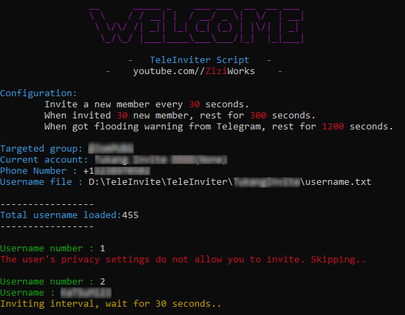

# TeleInviter by [Ziziworks](https://www.youtube.com/channel/UCW36UNroi3B4Ix9ln1e6rUQ?sub_confirmation=1)
[Youtube](https://www.youtube.com/channel/UCW36UNroi3B4Ix9ln1e6rUQ?sub_confirmation=1) |
[Instagram](https://www.instagram.com/ziziworks/) |
[Facebook](https://www.facebook.com/ziziworks/) |
[Telegram Channel](https://t.me/ziziworks) |
[Telegram Group](https://t.me/ziziworksgroup) |
[Twitter](https://twitter.com/ziziworks_MY)  
> A script written on Python for automatic telegram inviting.  
It can be used for inviting into group only, not working for channel.  
This script can be run on Window's command prompt
and Termux terminal on Android.



### Features:
- [x] Automatically invite username by username
- [x] Username file can be either **.txt** or **.csv**
- [x] Save active sessions
- [x] Allow 2FA (Two-Step Verification) login
- [X] Has **config.ini** for setting configurations
- [X] Can start script by double-clicking **teleinv.py**
- [X] Can start script using arguments ( _python teleinv.py phone_number optional_notes_ )
- [ ] Eliminate flood errors
## Download
Script is where the magic begins. Go ahead and download it now.    
If you don't download the script yet get it now by clicking [/releases](https://github.com/ziziwho/teleinviter/releases)
# Intallation
## Install Python on Windows

* Download [Python](https://www.python.org/downloads/) for Windows
* When you're installing python made sure you checked "Add Python 3.7 to PATH"
* `../your_path/` mean path/directory/location to your TeleInviter file.
* Open Windows's command prompt and enter command below:    
`cd ../your_path/`    
`pip install -r requirements.txt`    
#### Example:
`cd D:\teleinviter`  
`pip install -r requirements.txt`

## Install Python on Termux
* Download [Termux](https://play.google.com/store/apps/details?id=com.termux&hl=en) from Playstore 
* `../your_path/` mean path/directory/location to your TeleInviter file.
* Open termux enter commands below:  
`pkg update && pkg upgrade`  
`pkg install python git`  
`cd ../your_path/`  
`pip install -r requirements.txt`  
#### Example:
`pkg update && pkg upgrade`    
`pkg install python git`    
`cd /storage/emulated/0/teleinviter`    
`pip install -r requirements.txt`    
## Configuration
### Config.ini
* Config.ini consist setting for the script.
* You can edit it using any text editor such as Notepad
* You can obtain your own API ID at https://core.telegram.org/api/obtaining_api_id
> [SETTING]    
invite_interval = 35    
pax_size = 50    
pax_rest = 300    
flood_rest = 1200    
target_group = ziziworks    
api_id = 1102903    
api_hash = 344d3fe528197386d5ec96de03ef8e56       

Object | Variables | Description
------------ | ------------- | -------------
[SETTING] | ❌ | 🚫 Don't change this 🚫
invite_interval | 35 | Invite a username every 35 seconds
pax_size | 50 | Invite 50 username before a rest
pax_rest | 300 | Rest for 300 seconds, Set 0 for no rest
flood_rest | 1200 | If one's account got flood error from telegram. Rest for 1200 seconds
target_group | ziziworks | Invite to what group? Specify the group ID
api_id | 1102903 | Telegram's application API ID
api_hash | 344d3fe528197386d5ec96de03ef8e56 | Telegram's application API Hash

### Username file
* Username file consist a list of username used for inviting  
* Username file can be either **.txt** or **.csv**
* Script read username, line by line
#### Example:
```
Username1
Username2
Username3
...
```
# Start TeleInviter
#### Usage: 
> python teleinv.py phone_number [optional for notes]    

❗ Input number in international format (example: +1234567890)    

```
python D:\teleinviter\teleinv.py +639162995600
```

⚠️ Make sure you enter your phone number which linked with telegram. Do not enter the number listed in the example.    
* You can just double click on **teleinv.py** and it will ask any requirements later such as phone number and username_file.
* You can also run it by specifying required arguments as example below.
* Input number in international format (example: +60123456789)
* Username file can be either **.txt** or **.csv**  

`../your_path/` mean path/directory/location to your TeleInviter file.
> ##  Windows
* Open cmd (command prompt)
* Enter following command :    
`python ../your_path/teleinv.py +123456789 username.txt`
#### Example:    
`python D:\teleinviter\teleinv.py +123456789 username.txt`
> ## Termux
* Enter following command :    
`cd ../your_path/`  
`python ../your_path/teleinv.py +123456789 username.txt`
#### Example:
`python D:\teleinviter\teleinv.py +123456789 username.txt`
## Bugs and Issues

Have a bug or an issue with this script? [Open a new issue](https://github.com/ziziwho/teleinviter/issues/new) here on GitHub or leave a message on my [telegram](http://t.me/ziziwho).


---

> ** ⚠️ Disclaimer**<a name="disclaimer" />: Please be note that this is a learning project for me. I am by no means responsible for any usage of this script. Use on your own behalf. I'm also not responsible if your accounts get any punishment due to extensive use of this script. 
